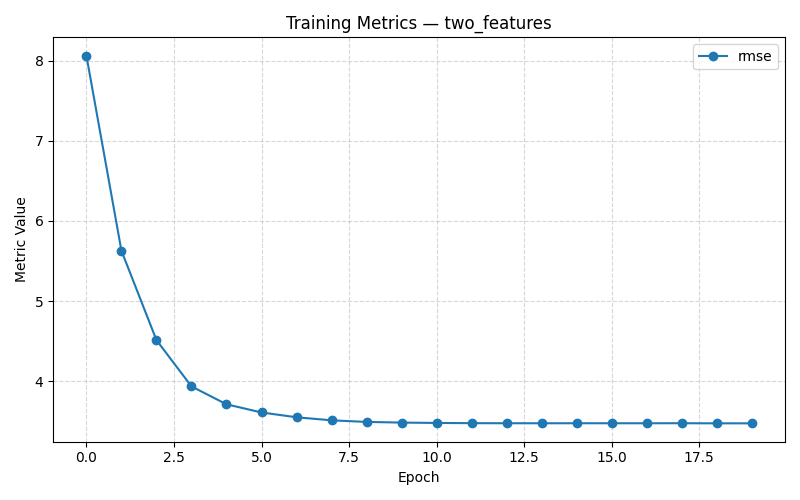
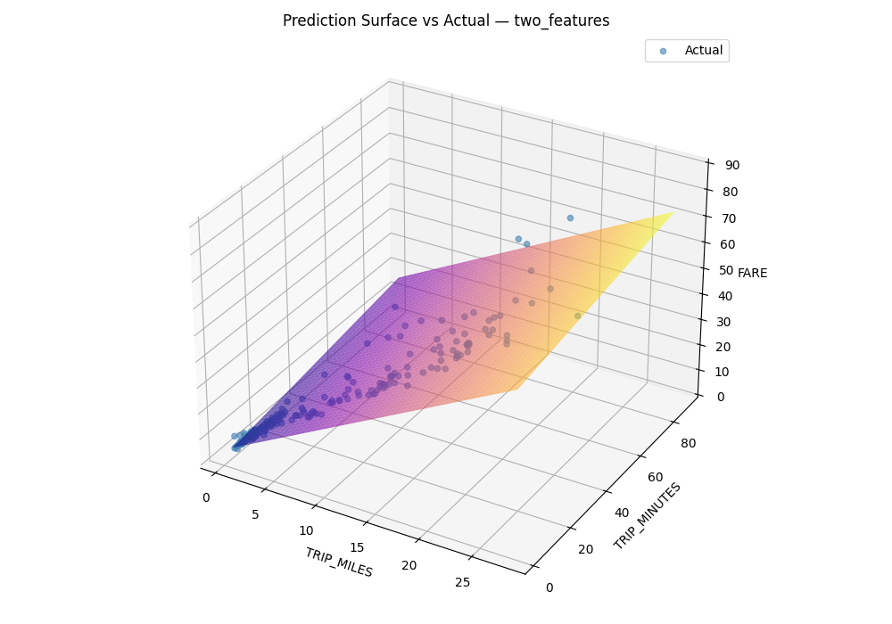

# Chicago Taxi Fare Prediction

A linear regression model built with Keras that predicts taxi fares in Chicago based on trip distance and duration. The project explores how adding more features affects model performance, comparing a single-feature model against a two-feature model.

---

## What This Project Does

The model is trained on real Chicago taxi trip data (Just 2 days data). It learns the relationship between trip characteristics and the fare charged, then predicts fares for new trips.

Two experiments are run and compared:

- **Experiment 1** uses only `TRIP_MILES` to predict fare
- **Experiment 2** uses both `TRIP_MILES` and `TRIP_MINUTES` to predict fare

The goal is to see whether adding trip duration as a second feature improves the model's predictions.

---

## Dataset

The data comes from the [Google Machine Learning Education](https://developers.google.com/machine-learning) Chicago taxi dataset. It is loaded directly from a public URL, so no manual download is needed.

Features used:

| Column | Description |
|---|---|
| `TRIP_MILES` | Distance of the trip in miles |
| `TRIP_SECONDS` | Duration of the trip in seconds |
| `TRIP_MINUTES` | Derived from `TRIP_SECONDS / 60` |
| `FARE` | Target label, the fare charged in USD |

---

## Model Architecture

The model is a minimal neural network that is mathematically equivalent to linear regression.

```
Input(s) --> Concatenate --> Dense(1) --> Prediction
```

For a single feature, the Concatenate layer is skipped. For two or more features, each gets its own input node and they are merged before the output layer.

The model is compiled with:
- **Optimizer:** RMSprop
- **Loss:** Mean Squared Error
- **Metric:** Root Mean Squared Error (RMSE)

---

## Results

Training metrics and prediction plots are saved automatically as `.png` files when the notebook is run.

**Training Metrics** tracks how RMSE changes across epochs for each experiment.



**Prediction Plot** for the single-feature model shows predicted vs actual fares on a 2D scatter plot.



The two-feature model produces a 3D surface plot with `TRIP_MILES` and `TRIP_MINUTES` on the horizontal axes and `FARE` on the vertical axis. The coloured plane is the model's learned prediction surface, and the blue dots are the actual fares from the dataset.

---

## Project Structure

```
.
├── ChicagoTaxiFare.ipynb       # Main notebook
├── TrainingMetrics.png         # RMSE over epochs
├── PredictionPlot.png          # Predicted vs actual fares
├── PairwiseRelationships.png   # Feature pairplot
├── CorrelationMatrix.png       # Feature correlation heatmap
├── README.md
└── .gitignore
```

---

## How to Run

**1. Clone the repo**
```bash
git clone https://github.com/your-username/chicago-taxi-fare.git
cd chicago-taxi-fare
```

**2. Install dependencies**

The first cell in the notebook handles installation automatically. If you prefer to install manually:
```bash
pip install keras~=3.8.0 matplotlib~=3.10.0 numpy~=2.0.0 pandas~=2.2.0 tensorflow~=2.18.0 seaborn~=0.13.0
```

**3. Run the notebook**

Open `ChicagoTaxiFare.ipynb` in Jupyter or VS Code and run all cells.

---

## Dependencies

| Package | Version |
|---|---|
| TensorFlow | 2.18.x |
| Keras | 3.8.x |
| NumPy | 2.0.x |
| Pandas | 2.2.x |
| Matplotlib | 3.10.x |
| Seaborn | 0.13.x |

---

## Key Concepts Demonstrated

- Building a Keras model with multiple named inputs
- Using a dataclass to manage hyperparameters cleanly
- Comparing single-feature vs multi-feature models
- Visualising a model's prediction surface in 3D

---

## Author

Built by Godfred Mills.
